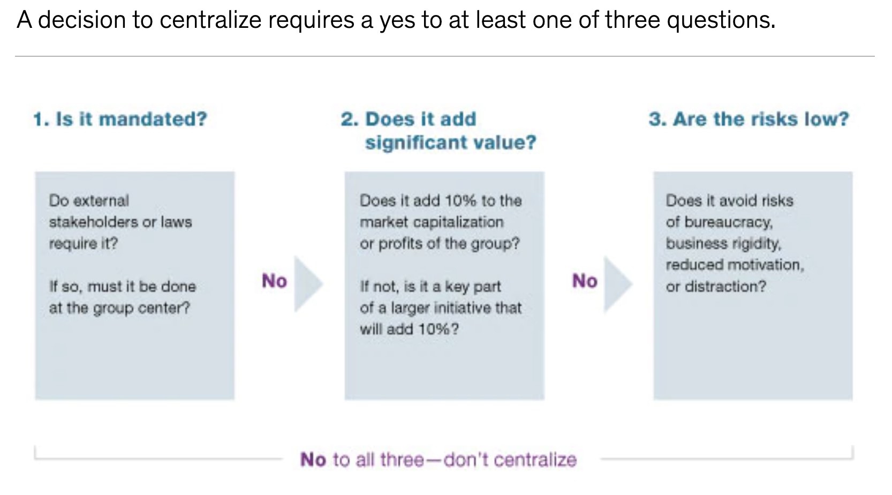

# Data Mesh and Beyond - Part 1: The Great Divide

This is a series of four blogs about and beyond one of the biggest hypes of 2021, a seemingly innocent set of principles called "Data Mesh" coming, like "Microservices", out of the innovative forge of ideas at Thoughtworks. Data Mesh was introduced by Zhamak Dehghani in the blog post ["How to Move Beyond a Monolithic Data Lake to a Distributed Data Mesh"](https://martinfowler.com/articles/data-monolith-to-mesh.html) in 2019.

In the course of this series of blogs, we wish to convince you that Data Mesh is and will be the most disruptive of all disruptive "trends" of the last ten years, and even more so if you take it and think and go beyond. Then, Data Mesh is, for us, more disruptive than IoT, more disruptive than Cloud, and more disruptive than AI. Why? Because Data Mesh is not primarily about technology. It is not only about to impact the technology required in bringing about the often much longed for "Digital Transformation" - it is going to impact and change entire organizations from the ground up.

These four blogs provide answers to all of the big three "W" questions, respectively: "Why", "What", and "How". This first blog is about "Why" the set of principles comprising "Data Mesh" are so badly needed to fix the "Digital Transformation" of all those thousands of companies where it is not going into the right direction.

## Business Organization is Mostly Decentralized

In the business world, decentralization is key to achieve economies of scale, and a well established cure to avoid diseconomies of scale. When Alfred P. Sloan took the position of CEO of General Motors (GM) in 1923, his secret sauce to push GM ahead of the leading American car manufacturer at the time, Ford, a corporation fundamentally centrally organized, was what he called "decentralization with co-ordination". In Sloan's GM, each division operated like an autonomous body (=decentralization), yet each division was answerable to a central authority (=co-ordination). As a result of that, under Sloan's chairmanship, GM overtook Ford only eight years later in 1931, and increased its share of the US automotive market from 12.7% to 47.5% (see e.g. [this article](https://www.pioneeringminds.com/alfred-sloan-organizing-corporation/)).

Fast forward to today to read anything from leading business consultancies such as McKinsey, and you can be sure that decentralization is almost always the guiding principle to organize businesses - only given up for centralization if really necessary to gain the effects of synergy, e.g. in the areas of purchasing, legal or human resources. In the blog ["To centralize or not to centralize?"](https://www.mckinsey.com/business-functions/people-and-organizational-performance/our-insights/to-centralize-or-not-to-centralize) from the McKinsey Quarterly (June 2011), the authors conclude that a decision to centralize requires a yes to at least one of three questions, as displayed below:



One of the biggest asset of decentralized companies is the enormous increase in "intrinsic motivation" of the employees, as wonderfully described in Daniel Pink's book ""

In another blog titled ["Making a Case for Decentralized Companies"](https://www.industryweek.com/leadership/article/21145316/is-decentralizing-right-for-your-company) from Industry Week from October 21, 2020, the author Olli Laurén names three main drivers of the performance of decentralized companies:
* *Common language*: "Decentralized companies talk about problems and opportunities in the same way - regardless of how dissimilar their businesses are."
* *Leaders with an ownership mindset*: "In a centralized company, you’re the star and you drive the car. In a decentralized company, you’re not just the driver; you are responsible for the whole pit team. You have to build the car and maintain it."
* *A culture that rejects the status quo*: "One of the key aspects of the culture at a decentralized company is that there is less internal politics, largely because business leaders can make decisions with a high degree of autonomy."

The author also reveals a study of 28 global machinery companies and their performance over five years. Of the decentralized companies, 100% had positive market-cap growth, while only 33% of the non-decentralized companies experienced the same. We depict the development of the three key KPIs of the companies from the study below. It speaks for itself:


## Digital Organizations are Mostly Centralized

When we, however, turn our gaze towards corporations partaking in what is often called "Digital Transformation", a completely different picture emerges. Here, *centralization* is often adopted as the guiding principle of organization. Not only do these "digitally transforming" companies simply add centralized "digital organizations" to implement anything digital, but in addition, *data* is also centralized whenever possible in so-called data warehouses, data lakes, or lakehouses.

Companies like Snowflake, Databricks, and also Fivetran are incredibly successful in convincing executives of leading corporations of their idea of centralizing data. And because especially larger corporations are mostly already used to having an already existing large centralized department called "IT", the idea of simply also centralizing data, like IT, sticks easily and quickly.

Fivetran for instance has published an ebook titled ["Centralizing Data with Fivetran"](https://get.fivetran.com/ebook-centralizing-data-with-fivetran.html) emphasizing the success stories of a number of customers who have centralized data using their ETL solution. The architecture chosen by those companies is always very simple: Data from a number of source systems is funneled through an ETL pipeline powered by Fivetran, and then put to rest in a data warehouse such as Google BigQuery or Amazon RedShift, which serves as the basis for the BI tooling. We show the architecture chosen by the company "Aceable", for instance, below:


## The Great Divide between Business Organization and Digital Organization         

Hence, the same executives who are naturally embracing the lessons of Mr. Sloan and the McKinseys and live in a company composed of *decentralized* business domains seem to be completely oblivious to the fact that they are, at the same time, accepting a practice of *centralizing* their digital organizations and also their data. What a contradiction!

What happens when companies take up this idea of centralizing not only IT, but also data, is often just an overly expensive mess, and this mess is actually aggravated by the aforementioned companies further advertising the centralization of data.

## New structure

1. Status quo, centralized architecture based on ideas of DW, DL, LH..., problems, solution: Data Mesh (principles here?). Blog 2: What/how DM in more detail, DM in technology - no need to wait for a "DM software", you can implement DM right now with existing tech!
2. DM not primary concerned with tech - it's about the orgnaizational setup. Blog 3: Centralized data architecture -> decentralized data architecture.
3. But actually, continue the train of thought of DM and go beyond DM. DM is about decentralizing data architecture and the organization of teams concerned with data. Given the technical underpinnings for implementing DM in Blog 2, we will take the underlying ideas of DM even further. We will go beyond them and not only propose a decentralized data organization but a decentralized organization of the digital transformation as a whole! We will show that the ideas behind DM lead to ways out of the current dilemma of the Digital Transformation, because, viewed in a simplified way, the ideas behind DM are the same ideas that have already impacted businesses worldwide since the times of Alfred P. Sloan more than a hundred years ago :)

## New start

Data is the new oil (ref!). But how can businesses really make use of their data in the best way possible? The industry is still struggling fiercely to solve that question. Zhamak Dehghani from Thoughtworks has found an answer - an answer that does not primarily rely on technology, but a lot more on the organizational setup. In the course of this blog series, we will put Zhamak's ideas into practice. We will lay out ways how to implement Data Mesh in technology - of course, Kafka will play a lead role here. We will then go beyond Data Mesh and continue Zhamak's train of thought to arrive at a new understanding on how not only data and analytics, but how entire digital organizations need to be set up to fulfill the promise of the Digital Transformation.

```
Digital Transformation
|suffers from
Centralized Organization (<- this is addressed by DM)
|caused by
Centralized Technology (<- this is addressed by DM)

Centralized digitization is wrong.
